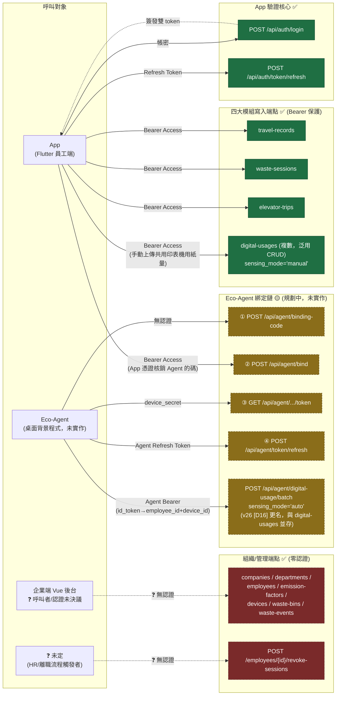

# Eco-Sensing 驗證機制 — 端點與呼叫對象關係表

> 目的：彙整**全系統**（App／企業端／Eco-Agent）所有與「身份驗證」相關的端點，列出各自的呼叫對象、認證方式、實作狀態，並標出**尚未決議**之處。
> 來源：`Eco-Sensing_App_驗證機制_開發參考.md`（App／後端 P1 落地清單）＋ `Eco-Sensing_專案context文件_v26.md`（§4.4.2、§4.4.4、5.1、8.4、[A3][D5][D16]，Eco-Agent 完整規格權威出處；v26 [D16] 修訂 `digital_usages`／`agent/digital-usage/batch` 並存決議，見 §3.1）＋ 現有程式碼（`routers/`、`services/auth.py`）。
> 狀態基準：2026-08-21，對應開發參考 §7.1 B1–B5 已完成、B6 待做。
> 圖例：✅ 已實作　🟡 已決議、尚未實作　❓ 連設計方向都還沒決議

---

## 1. 總覽表

### 1.1 App（員工端 Flutter）── 已實作

| 端點 | 呼叫對象 | 認證方式 | 狀態 | 備註 |
| --- | --- | --- | --- | --- |
| `POST /api/auth/login` | App | 無（帳密在 body） | ✅ | 驗 `employee.password_hash` → 簽 Access+Refresh、寫 `app_session`（B2） |
| `POST /api/auth/token/refresh` | App | Refresh Token（body） | ✅ | 比對 `app_session.refresh_token_hash`＋`status=active`（B2） |
| `POST /api/travel-records` | App | `Bearer`（`get_current_employee`） | ✅ | `employee_id` 由 token 解出，body 不接受（B3） |
| `PATCH /api/travel-records/{id}` | App | `Bearer` | ✅ | 同上 |
| `POST /api/waste-sessions` | App | `Bearer` | ✅ | 同上 |
| `PATCH /api/waste-sessions/{id}` | App | `Bearer` | ✅ | 同上 |
| `POST /api/elevator-trips` | App | `Bearer` | ✅ | 同上 |
| `PATCH /api/elevator-trips/{id}` | App | `Bearer` | ✅ | 同上 |
| `POST /api/digital-usages`（複數，泛用 CRUD） | App | `Bearer` | ✅ | **[D16]（v26）已決議**：這是 App 手動上傳「共用印表機」用紙量的專用管道，`sensing_mode='manual'`；與 Eco-Agent 自動感測路徑互斥於場域，見 §3.1 |
| `PATCH /api/digital-usages/{id}` | App | `Bearer` | ✅ | 同上；惟「已落庫後更正」的語意（App 重算覆蓋 vs 直接改庫值）context 文件仍列為 §7 待釐清（P2 細節，不阻塞 [D16] 主決策） |

### 1.2 App／管理者 ── 已實作但呼叫對象未定

| 端點 | 呼叫對象 | 認證方式 | 狀態 | 備註 |
| --- | --- | --- | --- | --- |
| `POST /api/employees/{employee_id}/revoke-sessions` | ❓ 未定（推測 HR／企業端後台，離職或裝置遺失時觸發） | ❓ 目前無 | ✅ 已實作、❓ 呼叫者與認證未決議 | B4；行為（撤銷該員工全部 `app_session`）已驗證正確，但**誰能打、要不要驗證身份**沒有決議 |

### 1.3 企業端（Vue 後台，推測）── 已實作、認證另議

| 端點 | 呼叫對象 | 認證方式 | 狀態 |
| --- | --- | --- | --- |
| `GET/POST/PATCH/DELETE /api/companies` | 企業端 Vue 後台（推測） | ❓ 無（§3.1「企業端認證另議」） | ✅ 實作、❓ 認證未決議 |
| `GET/POST/PATCH/DELETE /api/departments` | 同上 | ❓ 無 | 同上 |
| `GET/POST/PATCH/DELETE /api/employees` | 同上 | ❓ 無 | 同上（含建立員工帳號本身——目前無人審核） |
| `GET/POST/PATCH/DELETE /api/emission-factors` | 同上 | ❓ 無 | 同上 |
| `GET/POST/PATCH/DELETE /api/devices` | 同上 | ❓ 無 | 同上 |
| `GET/POST/PATCH/DELETE /api/waste-bins` | 同上 | ❓ 無 | 同上 |
| `GET/POST/PATCH/DELETE /api/waste-events` | 同上（樹莓派上行資料的管理視角） | ❓ 無 | 同上 |
| `GET/DELETE /api/travel-records`、`/waste-sessions`、`/elevator-trips`、`/digital-usages` | 企業端後台 or App「查自己的紀錄」？ | ❓ 無（B3 刻意沒動 GET/DELETE，見 §3.4） | ✅ 實作、❓ 保護範圍未決議 |

### 1.4 Eco-Agent（桌面背景程式）── 全部尚未實作

> 權威規格：context 文件 §4.4.2（裝置綁定六步驟）、§4.4.4（效期表）。表内四個端點是 context 文件 v0.23 明列的「P1 範圍」，但本後端目前**一行都還沒寫**（`grep` 不到任何 `agent`／`device_binding` 相關 router）。

| # | 端點 | 呼叫對象／認證 | 狀態 | 備註 |
| --- | --- | --- | --- | --- |
| ① | `POST /api/agent/binding-code` | Eco-Agent，**無認證** | 🟡 已決議未實作 | 建 `device` ＋ `binding_code`（`pending`、5 分鐘 TTL），回 `code`＋`device_secret` |
| ② | `POST /api/agent/bind` | **手機 App，帶 App 登入憑證（`Bearer`）** | 🟡 已決議未實作 | **App 與 Eco-Agent 認證鏈唯一的交會點**：App 用自己的 Access Token 掃碼核銷 Agent 的 `code`，後端才把 `employee_id` 灌進新建的 `device_binding` |
| ③ | `GET /api/agent/binding-code/{code}/token` | Eco-Agent，帶 `device_secret` | 🟡 已決議未實作 | 核銷後交付 Agent 專屬 Access＋Refresh |
| ④ | `POST /api/agent/token/refresh` | Eco-Agent，帶 Agent Refresh Token | 🟡 已決議未實作 | 比對 `device_binding.refresh_token_hash`；語意與 App 的 `/api/auth/token/refresh` 同構，但認證體系是**裝置**不是**員工** |
| — | `POST /api/agent/digital-usage/batch`（v26 [D16] 由 `digital-usage/batch` 更名、收進 `/api/agent/*` 命名空間） | Eco-Agent，帶 Agent Bearer | 🟡 已決議未實作 | Eco-Agent **三條自動感測路徑**專用（電腦／印表機／雲端，`sensing_mode='auto'`；asyncpg 直連＋條件式 upsert，[D4]），經 `id_token` 查 `device_binding` **同時解出 `employee_id` 與 `device_id`**——跟 `/api/digital-usages`（PostgREST 泛用 CRUD、App 員工 `Bearer`、`sensing_mode='manual'`）**並存,已決議互斥於場域,見 §3.1** |

---

## 2. 關係圖

---

## 3. 已決議事項（補充記錄）

### 3.1 `digital-usages`（複數，App 手動）vs `agent/digital-usage/batch`（Eco-Agent 自動）—— 已於 v26 [D16] 決議

> 此項在本文件初版（對照 context v25）列為「最重要的未決議落差」，v26 §4.4 [D16] 已正式決議，記錄於此供追溯。

- **決議**：兩條路徑**並存**，不是取代關係。
  - `POST /api/agent/digital-usage/batch`（v26 由 `digital-usage/batch` 更名、收進 `/api/agent/*`）：Eco-Agent **三條自動感測路徑**（電腦／印表機／雲端）專用，`sensing_mode='auto'`，經 `id_token` 查 `device_binding` 解出 `employee_id`＋`device_id`，走 asyncpg 直連。
  - `POST /api/digital-usages`（複數，既有 PostgREST 泛用 CRUD、B3 套的 App 員工 `Bearer`）：**保留**作 App 手動上傳「共用印表機」用紙量的專用管道，`sensing_mode='manual'`，App 端先彙總當日總量再上傳、後端一天一列覆蓋。
  - **互斥於場域，不重複計算**：個人專屬印表機一律走 Agent 自動（`auto`）；共用印表機（無 Agent SNMP 覆蓋）才用 App 手動（`manual`）。兩者不會同時出現在同一（`employee_id`, `usage_date`, `printer`）組合，故加總不重複。
  - ERD `DIGITAL_USAGE` 新增 `sensing_mode` 欄位；落庫唯一鍵依路徑＋`sensing_mode` 分四組 partial unique index（`uq_digital_usage_device`／`_printer`／`_printer_manual`／`_account`）。
- **仍待釐清（P2 細節，不阻塞 [D16] 主決策）**：`PATCH /api/digital-usages/{id}` 的「已落庫後更正」語意——App 重算當日總量後重送覆蓋，還是直接 PATCH 改庫值，context 文件列於 §7 待釐清項。
- **與本文件驗證機制範圍的交集**：[D16] 決議的是 `DIGITAL_USAGE` 的資料模型／去重機制（非本文件主題），但連帶把 `/api/digital-usages` 該用哪一種 `Bearer`（App 員工，非 Agent）拍板，直接解除了本文件的疑慮，故記於此。
- **注意（非本文件範圍，僅提醒）**：`sensing_mode` 欄位與四個 partial unique index，截至目前**尚未反映在 `db/schema.sql`**（context 文件標為 P1 優先工作項）；這是 `DIGITAL_USAGE` 冪等去重的後續工作，不屬驗證機制開發範圍，需要時另開任務處理。

### 3.2 Eco-Agent 綁定鏈：已決議、純粹待實作

- §4.4.2 的四個端點＋`agent/digital-usage/batch`（表 1.4）**設計已經定案**（context 文件明列為 P1 範圍），只是本後端還沒寫任何一行程式碼。這不是「未決議」，是「已決議未實作」，放在表裡供對照，不佔用你們的決議時間。

---

## 4. 未決議事項（❓，依重要性排序）

### 4.1 企業端（Vue 後台）認證機制

- §3.1 原文：「企業端 Vue 後台同為不驗帳密現況…企業端認證另議」——目前 `companies`／`departments`／`employees`／`emission-factors`／`devices`／`waste-bins`／`waste-events` 全部**零認證**，任何人都能建立/修改/刪除組織資料與員工帳號（含直接改別人的 `carbon_coin`／`level`）。
- 沒有決議：企業端要用什麼身份機制（HTTP Basic？獨立的企業帳號系統？沿用 `employee` 但加角色欄位？）。

### 4.2 `revoke-sessions` 的呼叫者與認證

- B4 只做了「撤銷動作本身」（`app_session.status → revoked`），沒有決議**誰能觸發**。目前掛在零認證的 `organizations.py` 底下，等同任何人都能撤銷任何員工的所有 session——這是可用的最小實作，但正式上線前必須決議認證方式（很可能要等 4.1 的企業端認證定案後才能一併補上）。

### 4.3 四大模組的 `GET`／`DELETE` 是否也要 `Bearer` 保護

- B3 只鎖了 `POST`／`PATCH`（會寫入或改動 `employee_id` 歸屬的動作），`GET`（list/get）與 `DELETE` 目前仍零認證。這是我在實作時做的範圍判斷（怕擋到企業端後台讀取全員資料的既有用法），**文件沒有明講**，需要決議：員工能不能透過 App 用同一組 Bearer 查自己的紀錄？企業端要不要用另一種方式（角色／全域 API key）存取全部資料？

---

## 5. 與現有文件的關係

- 本檔案是**橫向對照表**，把 `Eco-Sensing_App_驗證機制_開發參考.md`（App 側落地清單）與 context 文件 §4.4.2 的 Eco-Agent 規格**並排比較**，藉此浮現兩者交界處（`② POST /api/agent/bind` 由 App 呼叫、`digital-usages` vs `digital-usage/batch`）原本分散在兩份文件、不容易一眼看出的落差。
- 不重複兩份來源文件已有的設計理由（雙 token 選型、效期取值等），僅列端點與呼叫關係；設計理由請回原文件查閱。
